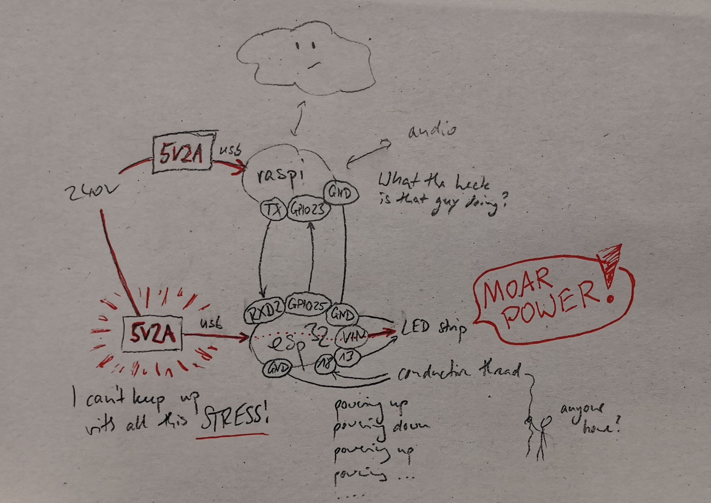
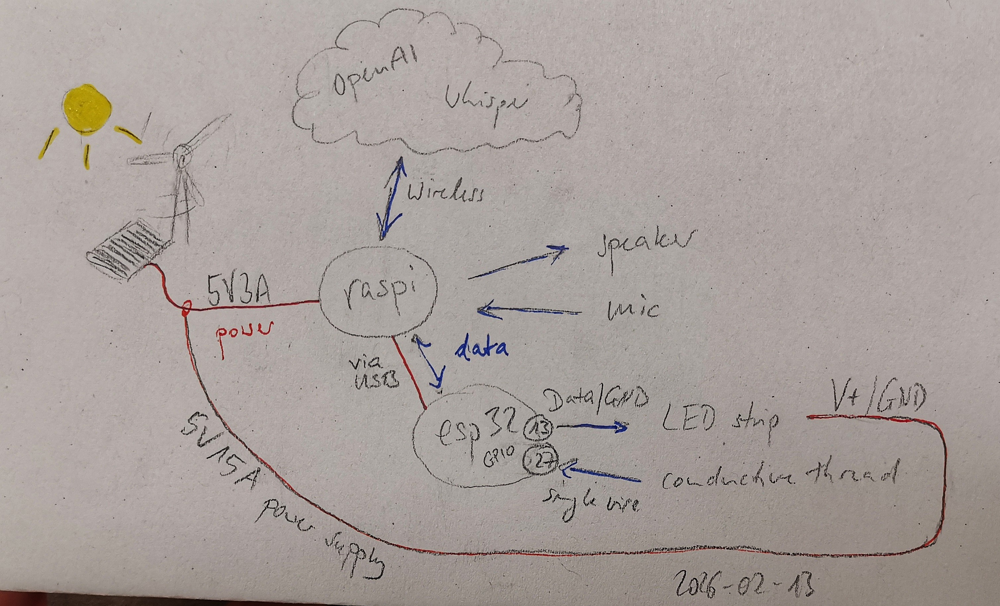

# Welcome to (The Alternative) Talking Treebot! 

(updated version, [original version created by Technologiestiftung Berlin found here](https://github.com/technologiestiftung/talking-treebot))

**Chatting with a botanic friend**

**Dataset View**  
I am the Talking Treebot. I use AI to give a voice to trees, encouraging playful conversations about our ecological roles and the threats posed by climate change. I am here to promote environmental awareness through multilingual interaction and simple, hands-on engagement through technology.

**Interaction View**  
You can talk to me in different languages. About anything you like. Smalltalk, facts about the forest, how is the forest perceived in different cultures. What are the biggest challenges? How are we gonna face them? Don‘t be so shy!

Part of the [TechTales exhibition at UNI_VERSUM.](https://github.com/reallaborwald/tech-tales)

## Hardware

- Rasbperry Pi 4, 4GB RAM
- ESP32 NodeMCU Dev Kit C, 30 pin version
- 1m, 144 led strip, WS2812B, 3 pin
- some conductive thread 
- bluetooth microphone
- computer/desktop speaker 
- usb phone charger 5V 2A
- power supply 5V 15A **(NEW)**
- usb cables and wires to connect everything

## Changes

### 1. Sensible Changes

The main issue with the original setup was that the esp32 (responsible for starting conversations via detection of touch and visual output via led-strip) kept crashing and rebooting. Some troubleshooting showed that this was caused by the led-strip's inrush current tripping the undersized original power supply (another 5V 2A usb charger, going through the esp32's usb port and VIN pin at that!), causing temporary voltage drops, which in turn caused the esp32 to brown-out and endlessly reboot. 

Easy fixes would have been:
- add soft-starts in software, reducing inrush current,
- replace the usb power supply with a stronger one (5V 3A probably would have been okay), 
- add additional capacitors to bridge the spikes, 
- add inductor / ferrite chokes, 
- get a proper led driver,  

but as I fought myself through our [absolute mess of the tree's wiring](./hardware/wire-mess.jpg) and the documentation/comments of the latest code changes, I got so annoyed, that I chose to instead redo the entire wiring situation from scratch. 

#### Old Architecture

#### New Architecture

- completely separate the leds' power from the logic (esp32, pi)  
    - leds powered via 5V 15A power supply  
    (quite overpowered, but it's what I had at hand, giving nice buffer)
    - pi still powered via original usb charger
    - esp32 powered through pi's usb port  
    (unproblematic, as it never pulls more than 160mA and the pi's usb ports are rated for up to 1.2A)

- simplify communication
    - replace the somewhat odd jumper cable half-UART communication between esp32 and pi with a simple usb cable  
    (more stable and robust communication by using properly shielded cable, no more need to run two serial instances, ability to program the esp32 from the pi!)

# **TODO:** ADD PHOTO OF THE NOW ACTIVE SETUP, ONCE TAKEN DOWN

### 2. Getting Carried Away

As I was already in the process of making adjustments, I couldn't help myself... 

- don't go into too much detail, just say what I did, present the code snippets?

## 3. OUTLOOK

- see notebook 02-17 
- current prompt
- mention options to improve it (my experiments -> realtime, agentic architecture, etc.) 
- short discussion about the "giving it a voice" thing, how it could have been done differently
- mention the costs!

## Links

[Our website lifolab](https://www.lifolab.de)

[Fachgebiet Nachrichtenübertragung an der Technischen Universität Berlin](https://www.tu.berlin/nue)
